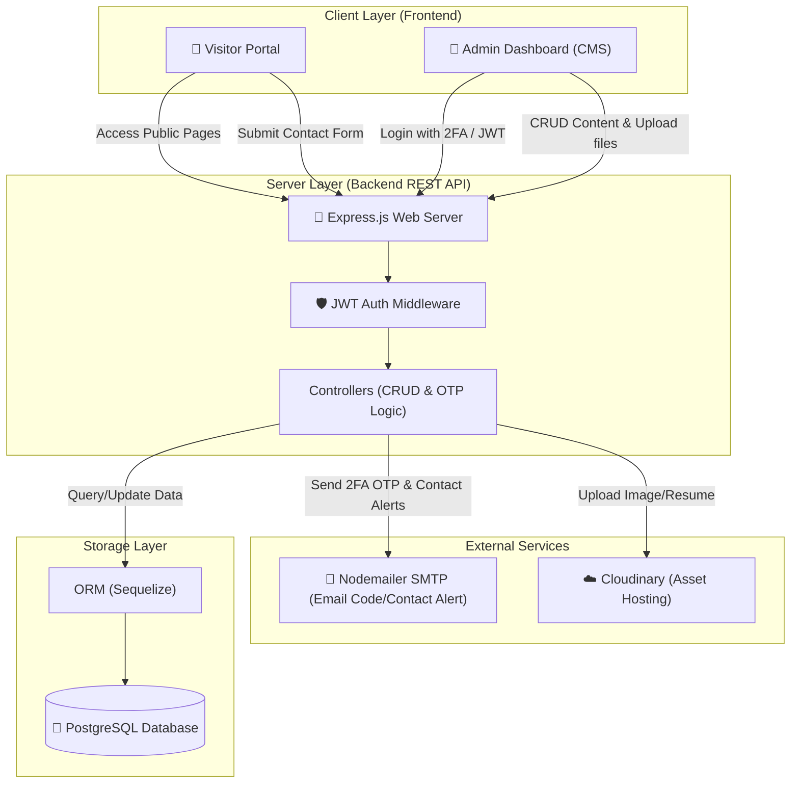

# Developer Portfolio & Content Management System (CMS)

A secure, production-ready developer portfolio and administrative CMS featuring dynamic CRUD capabilities, two-factor OTP authentication, automatic email alerts, and Cloudinary media uploads.

---

## Overview

### The Problem
Traditional developer portfolios are static websites. Adding new projects, editing skills, updating career experiences, or modifying profile biographies requires manual code updates, version control commits, and redeployment cycles. Additionally, contact form handlers either rely on third-party SaaS services with strict limits or offer no custom backend notification pipelines.

### The Solution
This project provides a self-hosted, full-stack dynamic portfolio and content management solution. It empowers developers to maintain their online professional presence in real time. The frontend features a sleek, animated, and responsive visitor showcase with performance benchmarking, while the backend exposes a robust REST API protected by state-of-the-art security practices.

### Main Purpose
- **Dynamic Content Administration**: Allows the portfolio owner to manage all projects, certifications, experiences, skills, and profile details via a secure Admin Dashboard without writing a single line of code.
- **Enterprise-Grade Security**: Protects data manipulation endpoints with two-factor email OTP verification and Double-Token (Access/Refresh) JWT authentication.
- **Recruiter Credibility Showcase**: Features custom interactive latency comparison simulations (simulating Redis vs direct database queries) and showcases real-world AI case studies.

---

## Features

✅ **Dynamic Content Management (CMS)**
- Direct CRUD (Create, Read, Update, Delete) dashboards for managing projects, skills, certificates, experiences, and basic bio descriptions in real time.

✅ **Multi-Factor Authentication (2FA OTP)**
- Higher-security login flow that generates a temporary 5-minute cryptographic OTP, hashes it in the database, and emails the code via Nodemailer. Includes rate-limiting (maximum 5 attempts) to prevent brute-force attacks.

✅ **Double-Token JWT Auth Architecture**
- Secure session management utilizing short-lived Access Tokens (for authorization headers or cookies) and long-lived Refresh Tokens stored in secure, `HttpOnly`, `SameSite=Lax` cookies to prevent XSS and CSRF.

✅ **Automated Cloud Uploads**
- Unified media upload handler built with Multer that streams project screenshots and PDF resumes to Cloudinary, returning optimized HTTPS URLs for database storage and cleaning up local tmp storage.

✅ **Instant Email Notifications**
- Built-in mail dispatch service that automatically alerts the administrator's email with client details whenever a visitor submits a contact form.

✅ **Advanced React 19 Client**
- Single Page Application (SPA) built using React 19, TypeScript, and Tailwind CSS v4, using Framer Motion v12 for modern hover states, slide-ins, and micro-interactions.

✅ **TanStack Query Caching**
- Integrates React Query v5 for efficient client-side state caching, reducing network request payloads and providing immediate UI feedback during CRUD operations.

✅ **Performance & Algorithm Benchmarking**
- Interactive frontend module demonstrating database optimization metrics, showing the contrast between direct database querying latency (\(O(N)\) / \(124\text{ms}\)) and cache-hit optimization (\(3\text{ms}\) – \(5\text{ms}\)).

---

## Tech Stack

### Frontend
- **React 19** – Component-driven client UI
- **TypeScript** – Type-safety and auto-completion
- **Tailwind CSS v4** – Modern CSS styling using the new Vite compilation engine
- **Framer Motion v12** – Premium physics-based interface animations
- **TanStack React Query v5** – Server state management and API caching
- **Axios** – Promise-based HTTP client

### Backend
- **Node.js** & **Express.js** – Asynchronous REST API server
- **Sequelize ORM** – Promise-based Object-Relational Mapping for database queries
- **JSONWebToken (JWT)** & **Bcrypt** – Cryptographic security, password hashing, and session management
- **Multer** – Multipart form-data handling for file uploads
- **Nodemailer** – SMTP transactional emailing engine

### Database
- **PostgreSQL** – Relational database storing users, projects, skills, certifications, and experiences

### AI / External Services
- **Cloudinary** – Cloud hosting for optimized media assets and resumes
- **Nodemailer SMTP Service** – OTP dispatch and Contact Form delivery

### DevOps / Tools
- **Vite** – Next-generation client bundler
- **Nodemon** – Backend hot reloading
- **ESLint & TS-Lint** – Static code analysis and formatting standardizers

---

## System Architecture

The application is structured into isolated client (Frontend) and server (Backend) components. Data is persisted in PostgreSQL, while external services handle email notifications and static assets.

### System Flow
1. **Client Interaction**: Visitors view the portfolio pages, while the Administrator logs into the CMS.
2. **Security Gateway**: Access to content management routes is restricted by a security middleware that validates JWT tokens and handles OTP generation/verification.
3. **Storage & Assets**: Project metadata is handled by Sequelize ORM targeting PostgreSQL. Binary files (PDF resumes, image showcases) are uploaded to Cloudinary, ensuring the server remains stateless.
4. **Communication Services**: Nodemailer dispatches 2FA validation codes during authentication and handles contact form notifications to the administrator.

